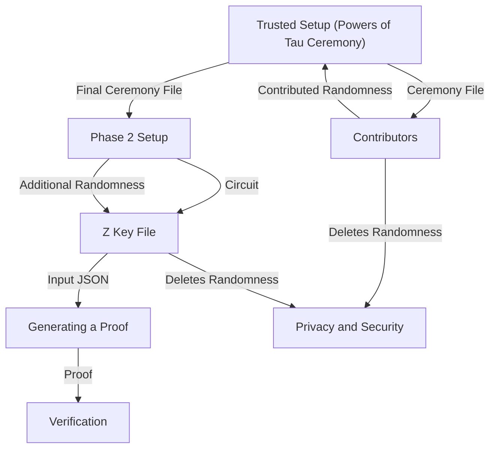

# Groth16

## About the Repository
### The branch contains how to setup, generate and verify groth16 based SNARKS

1. Trusted Setup (Powers of Tau Ceremony):
    - The Trusted Setup is often referred to as the "Powers of Tau Ceremony" for the growth 16 system.
    - It involves the creation of a ceremony using the bn128 elliptic curve.
    - The ceremony aims to generate randomness that will be used to set up the verification system for a specific circuit.
    - The ceremony starts by creating a ceremony file object.
    - Next, a large number of third-party participants are invited to contribute additional randomness to this ceremony file.
    - The number of participants can be arbitrary, and it is common to invite thousands or tens of thousands of parties.
    - Each participant contributes their random values to the ceremony file until the last participant completes the process.
    - After the ceremony is completed, it is essential to delete the contributed random values to ensure privacy and security.
    - The Powers of Tau ceremony ensures that a large number of independent contributions combine to create a highly random and secure setup.
2. Phase 2 Setup:
    - After the Powers of Tau ceremony is completed, the ceremony file is prepared for the Phase 2 setup.
    - The Phase 2 setup is specific to the circuit that needs verification.
    - The ceremony file and the circuit are intertwined to create what is called a Z key file, also known as the proving key.
    - The Z key file contains the randomness from the Powers of Tau ceremony, which is now used to set up the verification process for the particular circuit.
    - The Z key file is a critical component required for generating proofs for the specified circuit.
3. Optional: Additional Randomness for Z Key:
    - While the Z key file contains the randomness from the Powers of Tau ceremony, it is also possible to contribute additional randomness to enhance security.
    - Participants can follow a similar process of contributing randomness as in the Powers of Tau ceremony.
    - Contributing additional randomness to the Z key file is optional but recommended to further strengthen the security of the setup.
4. Generating a Proof:
    - To generate a proof for a specific circuit, three essential ingredients are needed: the circuit, the Z key file, and an input JSON file.
    - The input JSON file represents the inputs to the circuit that need to be verified.
    - The circuit and the input JSON file go through a transformation process, where all powers are stripped away, and the equation only contains additions and one multiplication for each equation.
    - The transformed equations can be represented as polynomials, which are used in the verification process.
    - The polynomials are then evaluated on a set of random points on an elliptic curve.
    - The evaluations of these polynomials are mapped to points on the elliptic curve, which are used as the proofs for verification.
5. Randomness Contribution Chains:
    - Throughout the setup procedure, two sets of random contributions are available: one for the Powers of Tau ceremony and another for the Z key setup.
    - It is crucial that at least one party keeps their random contributions completely secret and deleted after the setup process.
    - The privacy and security of the verification system depend on the confidentiality of the contributed random values.

Overall, the setup procedure ensures the establishment of a secure and private verification system for the specific circuit. It involves multiple participants contributing randomness and generating the necessary keys for proving and verifying the correctness of the circuit execution.

## Technical Details 
How to do all the above mentioned process with `solidity` `snarkJs` and `circom`

## Groth16 Setup

## syntax of Snark Js command

`npx snarkjs type_of_file_we_want_to_operate action_you_want_to_perform input_file output_file`

## Creating ceremony file

`npx snarkjs powersoftau new bn128 12 ceremony_0000.ptau -v`
 - `powersoftau` : name of ceremony
 - `bn128` : name of eleptic curve for polynomial evaluation
 - `12` : number of maximum constraint (ie: 2 ** 12)
 - `ceremony_0000.ptau` : name of ceremony file. It's conventional to name the file with 0000 and once people start ading randomness they increase the number.
 - `v` : verbose

## verifying ceremony file
Once the next contributor receives the ceremony file, it a good thing to `verify`(check if it is valid and not corrupted) the ceremony first then contribute to it.

`npx snarkjs powersoftau verify ceremony_0000.ptau`

if it says `powersoftau OK` it's a valid file.
here:
- `powersoftau` is the name of the ceremony
- `ceremony_0000.ptau` is the file name

## adding randomness to ceremony file / setup procedure
In real life cenario this file will be passed to other people and they will add randomness to this file. Just after the contribution to the ceremony file those randomness should be discarded.

`npx snarkjs powersoftau contribute ceremony_0000.ptau ceremony_0001.ptau -v`

here:
- `powersoftau` is the name of the ceremony
- `ceremony_0000.ptau` is the input file name
- `ceremony_0001.ptau` is the output file name

after this we will have to enter the `entropy` it is basically any random value.

Note: we only need the final ceremony file so we can delete intermidiate ceremony file.

## Preparing the file for phase 2
Till now the ceremony process was independent from the `circuit` but in phase 2 we will introduce `circuit` to the `ceremony` file. This process is done once all contributor have added randomness to the ceremony.

`npx snarkjs powersoftau prepare phase2 ceremony_0001.ptau ceremony_final.ptau -v`

here:
- `powersoftau` is the name of the ceremony
- `ceremony_0001.ptau` is the input file name
- `ceremony_final.ptau` is the output file name

## Introducing Circuit to Ceremony file
Before doing that we need to compile the circuit: `npx circom2 circuit.circom --r1cs`

Feeding `circuit` to `ceremony` file : `npx snarkjs groth16 setup circuit.r1cs ceremony_final.ptau setup_0000.zkey`

here
 - `circuit.r1cs` rics representation of the circuit
 - `ceremony_final.ptau` phase 2 file
 - `setup_0000.zkey` output file

 ## Adding randomness to the zkey file
 It's a good idea to add additional randomness to the `zkey` file

`npx snarkjs zkey contribute setup_0000.zkey setup_final.zkey`

## Verifying zkey file
Since zkey is made from combining `circuit` and `ceremony`, we will need both the file to verify the zkey.

`npx snarkjs zkey verify circuit.r1cs ceremony_final.ptau setup_final.zkey`

## Generating Proofs
- Create a `input.son` file with all the required inputs
- compile the `circuit` to `wasm` - `npx circom2 circuit.circom --wasm`
- Generating the proof `npx snarkjs groth16 fullprove input.json circuit_js/circuit.wasm setup_final.zkey proof.json public.json`

here
- `input.json` is the input file
- `circuit_js/circuit.wasm` is the wasm representation of circuit
- `setup_final.key` proving key
- `proof.json` output proof file
- `public.json` it contains the circuit output, in our case it is the hashed value from circuit execution, if we define any public signal it will also appear.

## Generating Verifier Smart Contract
SnarkJs can generate the `verifier smart` contract from the `zkey`file.

`npx snarkjs zkey export solidityverifier setup_final.zkey Verifier.sol`

Deploy this smart contract to chain

## Generating proof string
We need to generate the proof string to pass it to contract for verification

`npx snarkjs zkey export soliditycalldata public.json proof.json`

The output that we got, we need to pass that to the `verifyProof` function of the contract.